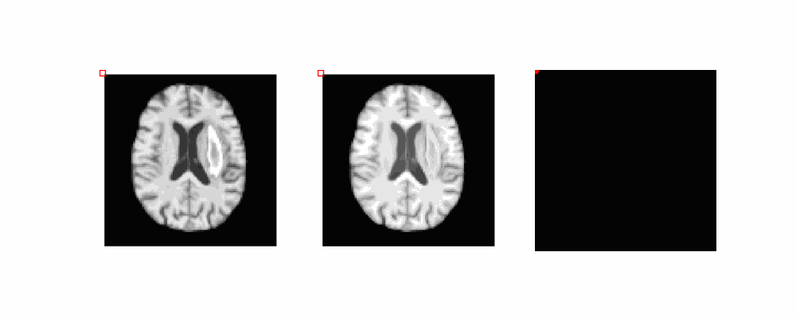

# Ensembled-SSIM-for-Unsupervised-Anomaly-Detection
Codebase for our ISBI 24 paper [DIFFUSION MODELS WITH ENSEMBLED STRUCTURE-BASED ANOMALY SCORING FOR UNSUPERVISED ANOMALY DETECTION](https://arxiv.org/pdf/2403.14262).

**Abstract**: 
Supervised deep learning techniques show promise in medical image analysis. However, they require comprehensive annotated data sets, which poses challenges, particularly for rare diseases. Consequently, unsupervised anomaly detection (UAD) emerges as a viable alternative for pathology segmentation, as only healthy data is required for training. However, recent UAD anomaly scoring functions often focus on intensity only and neglect structural differences, which impedes the segmentation performance. This work investigates the potential of Structural Similarity (SSIM) to bridge this gap. SSIM captures both intensity and structural disparities and can be advantageous over the classical l1 error. However, we show that there is more than one optimal kernel size for the SSIM calculation for different pathologies. Therefore, we investigate an adaptive ensembling strategy for various kernel sizes to offer a more pathology-agnostic scoring mechanism. We demonstrate that this ensembling strategy can enhance the performance of DMs and mitigate the sensitivity to different kernel sizes across varying pathologies, highlighting its promise for brain MRI anomaly detection.

## Data
We use the IXI data set, the BraTS21, MSLUB, ATLAS_v2 and WMH data set for our experiments. 
You can download/request the original data sets here:

* [IXI](https://brain-development.org/ixi-dataset/)
* [BraTS21](http://braintumorsegmentation.org/)
* [MSLUB](https://lit.fe.uni-lj.si/en/research/resources/3D-MR-MS/)
* [ATLAS v2](https://fcon_1000.projects.nitrc.org/indi/retro/atlas.html)
* [WMH](https://dataverse.nl/dataset.xhtml?persistentId=doi:10.34894/AECRSD )

If you’d like to use our preprocessed data, we’ve made preprocessed versions of the datasets available [here](https://1drv.ms/u/c/66229029a9e95461/EVb21X1kmXxCh_xfqMNmzH8B1Rqe_wWDHYzoQuiGj94k3Q?e=wjFP6h) (approx. 37G). 

After downloading, the directory structure of <DATA_DIR> should look like this: 

    <DATA_DIR>
    ├── Train
    │   ├── ixi
    │   │   ├── mask
    │   │   ├── t2
    │    │  └── t1
    ├── Test
    │   ├── Brats21
    │   │   ├── mask
    │   │   ├── t2
    │   │   └──seg
    │   ├── MSLUB
    │   │   ├── mask
    │   │   ├── t2
    │   │   └── seg
    │   ├── ATLAS_v2
    │   │   ├── mask
    │   │   ├── t1
    │   │   └── seg
    │   └── ...
    ├── splits
    │   ├──  Brats21_test.csv        
    │   ├──  Brats21_val.csv   
    │   ├──  MSLUB_val.csv 
    │   ├──  MSLUB_test.csv
    │   ├──  IXI_train_fold0.csv
    │   ├──  IXI_train_fold1.csv 
    │   └── ...                
    └── ...

You should then specify the location of <DATA_DIR> in the pc_environment.env file. Additionally, specify the <LOG_DIR>, where runs will be saved. 

## Environment Set-up
To download the code type 

    git clone git@github.com:FinnBehrendt/Ensembled-SSIM-for-Unsupervised-Anomaly-Detection.git

In your linux terminal and switch directories via

    cd Ensembled-SSIM-for-Unsupervised-Anomaly-Detection

To setup the environment with all required packages and libraries, you need to install anaconda first. 

Then, run 

    conda env create -f environment.yml -n ssim-uad

and subsequently run 

    conda activate ssim-uad
    pip install -r requirements.txt

to install all required packages.

## Run Experiments

To run the training and evaluation of the DDPM, run 

    python run.py experiment=DDPM/DDPM datamodule.cfg.mode=t2 

for T2 and
 
    python run.py experiment=DDPM/DDPM datamodule.cfg.mode=t1 
    
for T1 weighted scans.

For improved performance, take a look at our cDDPM [repo](https://github.com/FinnBehrendt/Conditioned-Diffusion-Models-UAD) and [paper](https://arxiv.org/abs/2312.04215).

**Citation**

    @article{behrendt2024diffusion,
      title={Diffusion Models with Ensembled Structure-Based Anomaly Scoring for Unsupervised Anomaly Detection},
      author={Behrendt, Finn and Bhattacharya, Debayan and Maack, Lennart and Kr{\"u}ger, Julia and Opfer, Roland and Mieling, Robin and Schlaefer, Alexander},
      journal={arXiv preprint arXiv:2403.14262},
      year={2024}
    }
